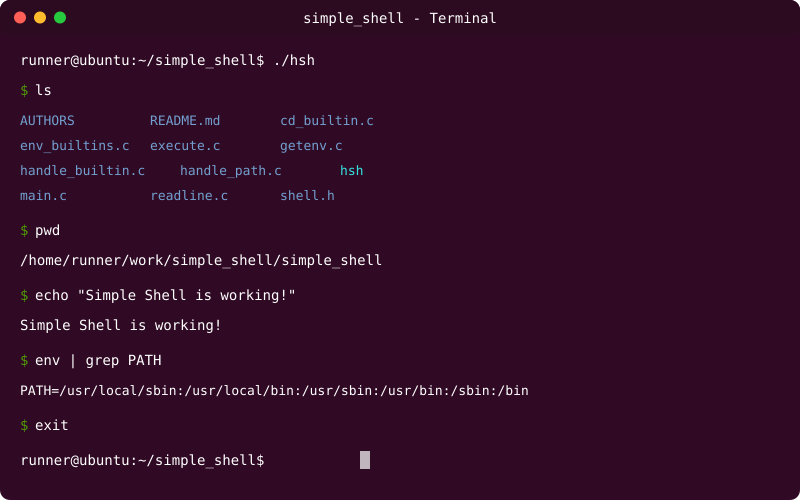

# 🐚 Simple Shell - UNIX Command Line Interpreter

## 📜 Table of Contents
* [1. Project Overview](#1-project-overview)
* [2. Team Roles and Responsibilities](#2-team-roles-and-responsibilities)
* [3. Technology Stack Overview](#3-technology-stack-overview)
* [4. Database Design Overview](#4-database-design-overview)
* [5. Feature Breakdown](#5-feature-breakdown)
* [6. API Security Overview](#6-api-security-overview)
* [7. CI/CD Pipeline Overview](#7-cicd-pipeline-overview)
* [8. Resources](#8-resources)
* [9. License](#9-license)
* [10. Created By](#10-created-by)

---

## 1. Project Overview

**Brief Description:**

Simple Shell is a custom-built UNIX command line interpreter developed in C, designed to replicate the core functionality of the standard `/bin/sh` shell. This project serves as an educational implementation that demonstrates fundamental systems programming concepts. These include process management, command parsing, environment variable manipulation, and system call utilization. The shell provides both interactive and non-interactive modes, allowing users to execute commands, manage built-in functions, and navigate the file system with ease.

The project addresses the challenge of understanding low-level operating system interactions by implementing a fully functional shell from scratch. It handles user input processing, command execution via fork-exec model, and PATH resolution for executable lookup. Additionally, it provides comprehensive error handling and memory management—all while adhering to strict coding standards and best practices.

**Project Goals:**

- Develop a fully functional UNIX command interpreter that mimics `/bin/sh` behavior
- Implement robust process management using fork(), execve(), and wait() system calls
- Provide support for both interactive and non-interactive command execution modes
- Implement essential built-in commands (exit, env, cd, setenv, unsetenv)
- Ensure proper memory management with zero memory leaks
- Maintain clean, readable code following Betty coding style standards
- Handle edge cases and errors gracefully with appropriate error messages
- Demonstrate proficiency in C programming and systems programming concepts

**Key Tech Stack:**

C Programming Language (C89 Standard), GCC Compiler, Linux System Calls (fork, execve, wait, chdir, stat), Standard C Library, POSIX APIs

---

## 2. Team Roles and Responsibilities

| Role | Key Responsibility |
|------|-------------------|
| **Project Lead / Systems Architect** | Overall project design, system architecture decisions, code review, and ensuring project meets specifications. Coordinates team efforts and manages timeline. |
| **Core Shell Developer** | Implements main shell loop, command parsing, tokenization, and input handling. Develops the read-eval-execute cycle and manages program flow. |
| **Process Management Specialist** | Handles fork-exec implementation, process creation, child process management, and signal handling. Ensures proper process synchronization. |
| **Built-in Commands Developer** | Implements all built-in commands (exit, env, cd, setenv, unsetenv) and their argument handling. Manages environment variable manipulation. |
| **Path Resolution Engineer** | Develops PATH environment variable parsing, executable file lookup, and command resolution logic. Implements file existence validation. |
| **Memory Management Specialist** | Ensures proper memory allocation/deallocation, prevents memory leaks, implements cleanup functions, and manages dynamic string operations. |
| **Testing & Quality Assurance** | Creates comprehensive test suites, validates edge cases, performs memory leak detection (Valgrind), and ensures Betty style compliance. |
| **Documentation Specialist** | Maintains project documentation, writes function documentation, creates user guides, and ensures code comments follow standards. |

---

## 3. Technology Stack Overview

| Technology | Purpose in the Project |
|-----------|----------------------|
| **C Language (GNU89 Standard)** | Primary programming language for implementing the shell. Provides low-level system access and fine-grained control over memory and processes. |
| **GCC Compiler** | Compiles the C source code with strict flags (-Wall -Werror -Wextra -pedantic) to ensure code quality and catch potential bugs at compile time. |
| **fork() System Call** | Creates child processes to execute commands without affecting the parent shell process. Essential for process isolation. |
| **execve() System Call** | Replaces child process image with the command to be executed. Core mechanism for running external programs. |
| **wait()/waitpid()** | Parent process synchronization with child processes. Ensures proper process cleanup and exit status retrieval. |
| **getline()** | Reads user input from stdin, handling variable-length input lines dynamically with automatic memory allocation. |
| **strtok()** | Tokenizes input strings into command and arguments by splitting on delimiters (space, tab, newline). |
| **stat() System Call** | Checks file existence and permissions when resolving command paths. Validates executable files before execution. |
| **chdir() System Call** | Changes the current working directory for the cd built-in command implementation. |
| **getcwd()** | Retrieves the current working directory path for PWD environment variable updates. |
| **malloc()/free()** | Dynamic memory allocation and deallocation for strings, command arrays, and data structures. Critical for memory management. |
| **access() System Call** | Verifies file accessibility and permissions before attempting execution. |
| **POSIX APIs** | Provides standard interfaces for file operations (open, read, write, close) and process management across UNIX-like systems. |
| **environ Variable** | Global variable holding environment variables. Used for env command and environment manipulation. |
| **isatty()** | Determines if stdin is connected to a terminal (interactive mode) or a pipe (non-interactive mode). |
| **write() System Call** | Outputs messages to stdout and stderr, providing control over output buffering and error handling. |

---

## 4. Database Design Overview

**Note:** This project is a command-line shell interpreter and does not utilize a database system. As a systems programming project focused on process management and command execution, it operates directly with the operating system and file system rather than persistent data storage.

**Key Entities:**

- **Command Structure**: Represents parsed user input with command name and arguments array
- **Process Information**: Manages parent and child process IDs, exit status codes, and process states
- **Environment Variables**: Key-value pairs stored in the `environ` global variable (e.g., PATH, HOME, PWD)

**Relationships:**

- **Shell to Process**: One shell process can spawn multiple child processes sequentially. Each command execution creates a new child process.
- **Process to Environment**: Each process inherits the environment variables from its parent process. Built-in commands can modify the environment, affecting future child processes.
- **Command to PATH**: Each command lookup traverses PATH directories sequentially until the executable is found or all paths are exhausted.

---

## 5. Feature Breakdown

**Core Shell Functionality:**

- **Interactive Mode**: Displays a prompt (`$ `), reads user input, executes commands, and displays the prompt again after each command completion. Provides a user-friendly command-line interface similar to standard shells.

- **Non-Interactive Mode**: Accepts commands from pipes or files without displaying prompts. Enables automation and script execution by processing commands line-by-line from stdin.

- **Command Execution with Arguments**: Parses command lines into command name and multiple arguments, then executes the specified program with the provided arguments using the execve system call.

- **PATH Resolution**: Automatically searches directories listed in the PATH environment variable to locate executable files. Users can run commands by name (e.g., `ls`) without specifying the full path (`/bin/ls`).

- **Built-in Command: exit**: Terminates the shell with an optional exit status code. Supports `exit` (uses last command status) and `exit n` (exits with status n). Validates numeric arguments and reports errors for illegal values.

- **Built-in Command: env**: Prints all environment variables in the format `KEY=VALUE`, one per line. Provides visibility into the current process environment without external dependencies.

- **Built-in Command: cd**: Changes the current working directory. Supports `cd` (goes to HOME), `cd <directory>` (changes to specified path), and `cd -` (switches to previous directory). Updates PWD and OLDPWD environment variables automatically.

- **Built-in Command: setenv**: Creates a new environment variable or modifies an existing one. Usage: `setenv VARIABLE VALUE`. Validates input to ensure both variable name and value are provided.

- **Built-in Command: unsetenv**: Removes an environment variable from the environment. Usage: `unsetenv VARIABLE`. Validates that the variable name is provided and handles non-existent variables gracefully.

- **Error Handling**: Provides informative error messages when commands are not found, execution fails, or invalid arguments are provided. Error messages include the shell name and command line number for debugging.

- **EOF Handling (Ctrl+D)**: Gracefully handles end-of-file condition by exiting the shell cleanly when EOF is detected on stdin. Ensures proper resource cleanup and status code return.

- **Memory Management**: Implements thorough memory cleanup with no memory leaks. All dynamically allocated memory is properly freed before program termination. Validated with Valgrind memory checker.

- **Signal Handling**: Responds appropriately to Ctrl+C (SIGINT) by displaying a new prompt without terminating the shell, maintaining user session continuity.

- **Custom String Functions**: Implements custom versions of standard string functions (_strlen, _strcmp, _strcpy, _strcat, _strdup) to minimize dependencies and demonstrate low-level string manipulation.

---

## 6. API Security Overview

**Note:** This shell is a local command-line interpreter that does not expose network APIs or web services. Security considerations focus on safe system interaction and process management rather than API endpoint protection.

**Key Security Measures:**

- **Input Validation**: All user input is validated before processing. Command arguments are checked for proper format, and built-in commands validate their arguments to prevent malformed input from causing crashes or undefined behavior. This is crucial to prevent command injection and buffer overflow attacks.

- **Memory Safety**: Strict memory management prevents buffer overflows, use-after-free vulnerabilities, and memory leaks. All malloc() calls are checked for NULL returns, and proper bounds checking is performed on string operations. Memory is freed immediately after use to minimize attack surface.

- **Path Traversal Protection**: The PATH resolution mechanism only searches predefined directories from the PATH environment variable, preventing arbitrary file execution from untrusted locations. Commands with `/` are executed directly only if they exist and have proper permissions.

- **Privilege Management**: The shell runs with the same privileges as the user who launches it, preventing privilege escalation. It does not implement setuid/setgid operations and relies on the operating system's permission model.

- **Error Handling**: All system calls (fork, execve, chdir, stat) check return values and handle errors appropriately. Failed operations report errors without exposing sensitive system information that could aid attackers.

- **Environment Variable Sanitization**: Built-in commands that modify environment variables (setenv, unsetenv) validate input to prevent injection of malicious environment values that could affect child process behavior.

- **Command Injection Prevention**: Input tokenization safely splits commands and arguments without evaluating shell metacharacters (`;`, `|`, `&`, `>`, `<`), preventing command chaining exploits common in web applications.

**Why Security Matters:**

Even though this is a local shell, security is crucial because it directly interfaces with the operating system. Improper handling of user input or system calls could allow malicious users to crash the shell, corrupt memory, execute unintended commands, or potentially escalate privileges. Following secure coding practices ensures the shell behaves predictably and safely under all conditions.

---

## 7. CI/CD Pipeline Overview

**Continuous Integration and Continuous Deployment (CI/CD)** is a software development practice that automates the process of testing, building, and deploying code changes. For this Simple Shell project, implementing a CI/CD pipeline would ensure code quality, catch bugs early, and maintain consistency across development cycles.

**Why CI/CD Matters for This Project:**

In a collaborative development environment, multiple developers may contribute code simultaneously. CI/CD pipelines automatically validate each code change against quality standards, run comprehensive test suites, and ensure that new features don't break existing functionality. This is especially important for systems programming projects like a shell, where bugs can cause crashes, memory leaks, or security vulnerabilities.

**Recommended CI/CD Strategy:**

- **GitHub Actions Integration**: Utilize GitHub Actions to automatically trigger builds and tests on every push and pull request. Configure workflows to compile the code with strict GCC flags and run all test cases.

- **Betty Style Checker**: Integrate Betty style checker as a CI step to automatically verify code formatting and style compliance before merging changes, ensuring consistent code quality.

- **Valgrind Memory Testing**: Run Valgrind on test cases in CI to detect memory leaks, use-after-free errors, and invalid memory accesses. This catches memory management issues before they reach production.

- **Automated Testing Suite**: Develop shell scripts or test programs that execute various command scenarios, including edge cases, and verify correct output and exit codes. Run these tests automatically in CI.

- **Static Code Analysis**: Incorporate static analysis tools (like cppcheck) to detect potential bugs, code smells, and security vulnerabilities without executing the code.

- **Build Artifacts**: Archive compiled binaries as CI artifacts for each successful build, enabling easy deployment and version tracking.

- **Docker Containerization**: Use Docker containers in CI to ensure consistent build environments across different platforms and developer machines, eliminating "works on my machine" issues.

**Tools Involved:**

- **GitHub Actions**: Workflow automation and CI/CD orchestration
- **GCC**: Automated compilation with warning flags
- **Valgrind**: Memory leak detection and analysis
- **Betty**: Code style checking and enforcement
- **Shell Scripts**: Test automation and validation
- **Docker**: Containerized build environments

**Current Status:**

This repository does not currently have automated CI/CD pipelines configured. Future enhancements should include adding `.github/workflows/` configuration files to implement the above CI/CD strategy.

---

## 8. Resources

**Learning Materials:**

- [Unix Shell - Wikipedia](https://en.wikipedia.org/wiki/Unix_shell)
- [Thompson Shell History](https://en.wikipedia.org/wiki/Thompson_shell)
- [Ken Thompson Biography](https://en.wikipedia.org/wiki/Ken_Thompson)
- [Fork System Call - man page](https://man7.org/linux/man-pages/man2/fork.2.html)
- [Execve System Call - man page](https://man7.org/linux/man-pages/man2/execve.2.html)
- [Wait/Waitpid - man page](https://man7.org/linux/man-pages/man2/wait.2.html)

**Development Tools:**

- [Betty Style Guide](https://github.com/alx-tools/Betty)
- [GCC Compiler Documentation](https://gcc.gnu.org/onlinedocs/)
- [Valgrind Memory Debugger](https://valgrind.org/docs/manual/manual.html)

**Reference Documentation:**

- [GNU C Library Manual](https://www.gnu.org/software/libc/manual/)
- [POSIX Standards](https://pubs.opengroup.org/onlinepubs/9699919799/)
- [Advanced Programming in the UNIX Environment by W. Richard Stevens](https://www.apuebook.com/)

---

## 9. License

This project is licensed under the **MIT License**.

Permission is hereby granted, free of charge, to any person obtaining a copy of this software and associated documentation files (the "Software"), to deal in the Software without restriction, including without limitation the rights to use, copy, modify, merge, publish, distribute, sublicense, and/or sell copies of the Software, and to permit persons to whom the Software is furnished to do so, subject to the following conditions:

The above copyright notice and this permission notice shall be included in all copies or substantial portions of the Software.

THE SOFTWARE IS PROVIDED "AS IS", WITHOUT WARRANTY OF ANY KIND, EXPRESS OR IMPLIED, INCLUDING BUT NOT LIMITED TO THE WARRANTIES OF MERCHANTABILITY, FITNESS FOR A PARTICULAR PURPOSE AND NONINFRINGEMENT. IN NO EVENT SHALL THE AUTHORS OR COPYRIGHT HOLDERS BE LIABLE FOR ANY CLAIM, DAMAGES OR OTHER LIABILITY, WHETHER IN AN ACTION OF CONTRACT, TORT OR OTHERWISE, ARISING FROM, OUT OF OR IN CONNECTION WITH THE SOFTWARE OR THE USE OR OTHER DEALINGS IN THE SOFTWARE.

---

## 10. Created By

**Phinehas Macharia** ([@MachariaP](https://github.com/MachariaP))

Systems Programmer | Shell Developer | C Enthusiast

Email: walburphinehas78@gmail.com

---

## 🚀 Getting Started

### Compilation

Compile the shell with the following command:

```bash
gcc -Wall -Werror -Wextra -pedantic -std=gnu89 *.c -o hsh
```

### Usage

**Interactive Mode:**

```bash
$ ./hsh
$ ls
AUTHORS  README.md  cd_builtin.c  env_builtins.c  execute.c  getenv.c  handle_builtin.c  handle_path.c  hsh  main.c  readline.c  shell.h  string.c  tokenizer.c  tools.c  utils.c
$ pwd
/home/user/simple_shell
$ echo "Hello, World!"
Hello, World!
$ exit
```

**Non-Interactive Mode:**

```bash
$ echo "ls -la" | ./hsh
total 92
drwxrwxr-x 3 user user  4096 Nov  4 10:30 .
drwxrwxr-x 5 user user  4096 Nov  3 14:22 ..
-rw-rw-r-- 1 user user   150 Nov  4 09:15 AUTHORS
...

$ cat commands.txt
pwd
ls
env
$ ./hsh < commands.txt
/home/user/simple_shell
AUTHORS  README.md  hsh  main.c  shell.h
USER=user
HOME=/home/user
PATH=/usr/local/bin:/usr/bin:/bin
...
```

### Example Session



```bash
$ ./hsh
$ pwd
/home/runner/work/simple_shell/simple_shell
$ ls -la
total 100
drwxrwxr-x 2 runner runner  4096 Nov  4 14:17 .
drwxrwxr-x 3 runner runner  4096 Nov  4 14:10 ..
-rw-rw-r-- 1 runner runner   150 Nov  4 14:17 AUTHORS
-rw-rw-r-- 1 runner runner 15824 Nov  4 14:17 README.md
-rwxrwxr-x 1 runner runner 22040 Nov  4 14:17 hsh
$ env | grep PATH
PATH=/usr/local/bin:/usr/bin:/bin:/usr/games
$ cd ..
$ pwd
/home/runner/work/simple_shell
$ cd -
/home/runner/work/simple_shell/simple_shell
$ exit 0
```

### Built-in Commands

| Command | Description | Usage |
|---------|-------------|-------|
| `exit [n]` | Exit the shell with optional status code | `exit` or `exit 98` |
| `env` | Print all environment variables | `env` |
| `cd [directory]` | Change current directory | `cd /tmp` or `cd` or `cd -` |
| `setenv VAR VALUE` | Set or modify environment variable | `setenv PATH /usr/bin` |
| `unsetenv VAR` | Remove environment variable | `unsetenv TEMP` |

---

## 📊 Project Statistics

- **Lines of Code**: 946 lines
- **Source Files**: 12 C files
- **Header Files**: 1 header file (shell.h)
- **Functions**: 30+ functions
- **Built-in Commands**: 5 (exit, env, cd, setenv, unsetenv)
- **System Calls Used**: 20+ (fork, execve, wait, chdir, stat, etc.)

---

## 🤝 Contributing

This project was developed as part of an educational program. While it's primarily for learning purposes, suggestions and feedback are welcome. Please ensure any contributions follow the Betty coding style and maintain the project's educational focus.

---

## 📧 Contact

For questions, suggestions, or collaboration opportunities:

**Phinehas Macharia** ([@MachariaP](https://github.com/MachariaP))  
Email: walburphinehas78@gmail.com  
Project Repository: [simple_shell](https://github.com/MachariaP/simple_shell)

---

**⭐ If you found this project helpful, please consider giving it a star!**

---

*This project is part of the ALX Software Engineering curriculum, focused on systems programming and understanding the inner workings of UNIX shells.*
